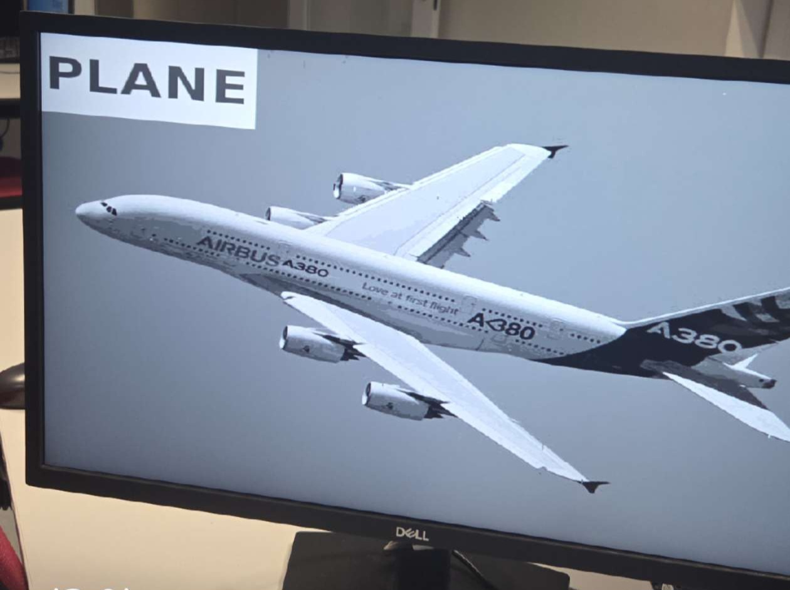

# 3A-SEI-SoC-CNN

## Overview
This project focuses on the implementation of a **Convolutional Neural Network (CNN)** using **High-Level Synthesis (HLS)** for FPGA deployment and **HW/SW co-design** with a RISC-V softcore platform.

- **Project:** 3A-SEI-SoC-Cpp  
- **Authors:** Ordan ONOKOMBA & Milane DAOUDI  
- **Objective:** Complete CNN implementation from C++ to FPGA with HLS and HW/SW co-design on RISC-V platform  

---

## WORKFLOW SUMMARY

**Phase 1: HLS CNN Implementation (ZYBO Z7)**  
C++ -> Catapult HLS -> RTL -> Vivado -> FPGA  

**Phase 2: HW/SW Co-Design (Nexys A7)**  
RISC-V Softcore + Custom IP + Software Application  

---

## Part I: CNN Catapult

CNN implementation in C++ for HLS and FPGA deployment.  
Design flow uses Catapult HLS for C++ -> RTL generation and Vivado for FPGA implementation on ZYBO Z7 board.

**Target Platform:** ZYBO Z7 FPGA board  

### PREREQUISITES

- **Catapult HLS**  

source bash_mentor_24

    Vivado
source bash_vivado_20

PROJECT STRUCTURE

Header Files (./)

    fixed_var.hpp -> Fixed-point variable definitions

    coeff.hpp -> Coefficient definitions

    cnn_hls.hpp -> Main CNN HLS header

    forward_debug.hpp -> Top interface header

    images.hpp -> Image data structures

Source Files (./)

    images.cpp -> Image pixels

    coeff.cpp -> Coefficient initialization

    forward_debug.cpp -> Top-level implementation

Testbench

    TOP_BENCH.cpp -> Top-level testbench

CATAPULT HLS FLOW
text

C++ Code
   |
directives.tcl
   |
RTL (.edf)

Configuration: Edit N in TOP_BENCH.cpp
cpp

const int N = 1;  // Possible values: 1, 2, 3

VIVADO FLOW

.edf File -> Vivado Project -> forward_top.vhd + constraint.xdc -> ZYBO Z7 Implementation

Required Files:

    vivado/forward_top.vhd -> Top-level VHDL wrapper

    constraint.xdc -> Timing constraints

Part I Results

CNN Accuracy Image:

Demonstration Video (ZYBO Z7):
Video file: `media/demoCNN_zybo.mp4`  
View online: [Google Drive Link](https://drive.google.com/drive/u/0/folders/1SrWNmaJquxTNEC5-InbE-11IsQloT2ux)

NOTES

    CNN inference fully implemented in C++ and synthesized using HLS

    Debug interface allows validation of predictions on FPGA

    Complete workflow: C++ -> HLS -> RTL -> FPGA

Part II: HW/SW Co-Design with RISC-V Platform

Team: Milane DAOUDI / Ordan ONOKOMBA / Jérémie CHAGNY / Martin LAURENT
OBJECTIVES

Develop a demonstrator based on a RISC-V softcore implemented on FPGA.
We will develop, test, and integrate different software components, inspired by practical work on the Rocket Chip platform.
HARDWARE PLATFORM

    Board: Nexys A7

    Softcore: RISC-V RV64IMAFD (Rocket Chip)

    Memory: Internal BRAM - 4,860 KB

Integrated IP Cores:

    VGA Controller, SD Card Controller

    UART, PLIC (Platform-Level Interrupt Controller)

    Push Buttons

MEMORY MAP
text

0x4000_0000 -> Bootloader

0x8000_0000 -> Application

    • SD Card Image (PPM P6) Reading
    • Image Preprocessing
    • Filters (Sobel / CNN)
    • VGA Display
    • Interrupt Management

Part II Results
  

This repository demonstrates a full C++ -> HLS -> RTL -> FPGA workflow along with HW/SW co-design on a RISC-V softcore.
