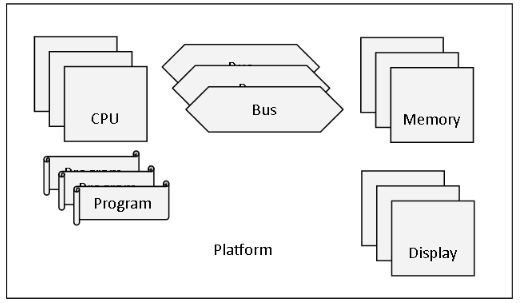

# 3A-SEI-SoC-PLATFORM

## Overview
This project focuses on **C++ compilation, testing, and memory analysis** using **CMake**, **CTest**, and **Valgrind**.

- **Project**: 3A-SEI-SoC-Hardware-Platform  
- **Authors**: Ordan ONOKOMBA & Milane DAOUDI  
- **Objective**: Build, test, and verify memory usage

This project models a simplified (and intentionally unrealistic) simulator of hardware components.  
The simulator loads textual definitions of hardware components, builds a platform with these components, and simulates their behavior.  

The platform consists of **CPUs, buses, memories, and displays**, with each CPU running its own program.  

---

## Build & Test Instructions

### 1. Create the build directory

mkdir -p build
cd build

2. Generate Makefiles

cmake ..

3. Compile all targets and run tests

make
ctest --verbose

Compile and Run Specific Targets

    Compile a specific test

make test_name
./test_name

    Compile and run main.cpp

make main
./main ../data/platformfile.txt numberSteps -v

    The -v flag enables verbose mode (optional).

Memory Analysis with Valgrind

    Basic check for memory leaks and errors

valgrind --leak-check=full ./test_name

    Detailed analysis (recommended)

valgrind --leak-check=full --show-leak-kinds=all --track-origins=yes ./test_name

Notes:

    Run Valgrind on the executable name (without .cpp).

    Make sure all dependencies are installed before building.
